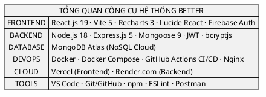
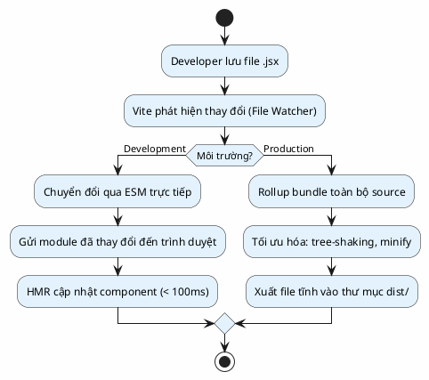
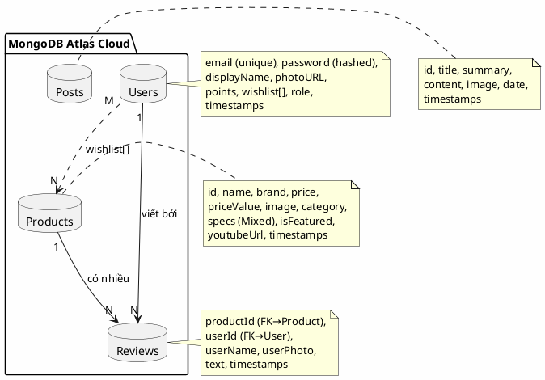
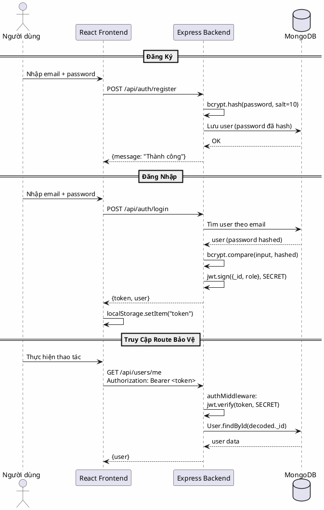
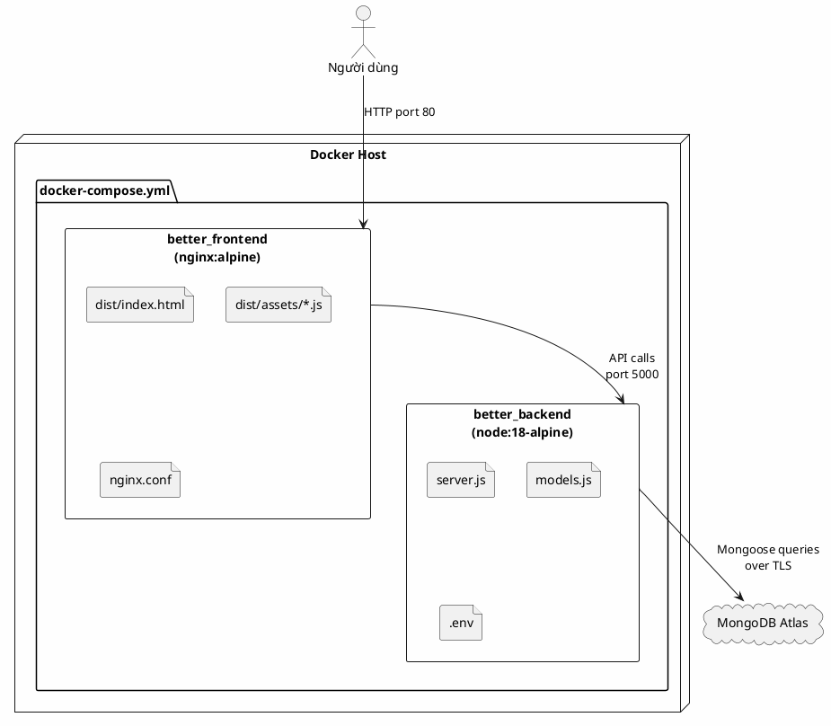
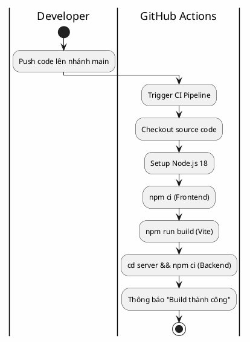
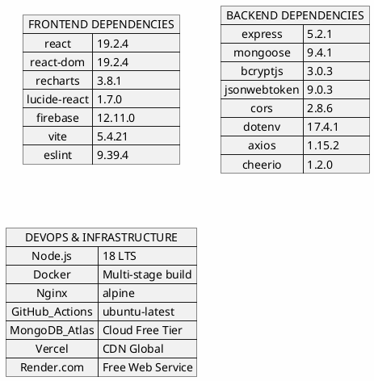

## CHƯƠNG 2. CÁC CÔNG CỤ HỖ TRỢ XÂY DỰNG WEBSITE

Chương này trình bày chi tiết các công nghệ, thư viện và công cụ đã được sử dụng trong quá trình phát triển hệ thống Better. Mỗi công nghệ được phân tích về ưu điểm, nhược điểm và lý do lựa chọn cho đề tài.

### Tổng Quan Các Công Cụ Sử Dụng

---

### 2.1 React.js

**React.js** là thư viện JavaScript mã nguồn mở do Meta (Facebook) phát triển từ năm 2013, chuyên dùng để xây dựng giao diện người dùng (UI) theo mô hình Component-based. Dự án Better sử dụng **React phiên bản 19.2.4**.

**Ưu điểm:**
- **Virtual DOM:** React tạo một bản sao DOM ảo trong bộ nhớ, chỉ cập nhật các phần thay đổi thực sự lên DOM thật, giúp hiệu suất render nhanh vượt trội so với thao tác DOM truyền thống.
- **Component-based Architecture:** Giao diện được chia thành các component độc lập (`Header`, `ProductCard`, `CompareSection`, `AIAnalyzer`...), dễ tái sử dụng và bảo trì.
- **React Hooks:** Hệ thống Hooks (`useState`, `useEffect`, `useContext`) cho phép quản lý trạng thái và vòng đời component mà không cần viết class, giúp code gọn gàng và dễ đọc hơn.
- **Hệ sinh thái lớn:** Hơn 2 triệu package trên npm, tài liệu phong phú và cộng đồng hỗ trợ đông đảo.

**Nhược điểm:**
- Chỉ là thư viện UI, không phải framework hoàn chỉnh – cần kết hợp thêm thư viện routing, state management nếu ứng dụng phức tạp.
- Tốc độ cập nhật nhanh, đôi khi gây khó khăn khi nâng cấp phiên bản.

**Lý do chọn cho đề tài:** React là thư viện front-end phổ biến nhất thế giới (theo Stack Overflow Survey 2024), phù hợp với mô hình SPA của Better và đảm bảo sinh viên tiếp cận công nghệ đúng chuẩn công nghiệp.

---

### 2.2 Vite

**Vite** là công cụ build (build tool) thế hệ mới cho ứng dụng JavaScript, được tạo bởi Evan You (tác giả Vue.js). Dự án sử dụng **Vite phiên bản 5.4.21** với plugin `@vitejs/plugin-react`.

**Ưu điểm:**
- **Hot Module Replacement (HMR) cực nhanh:** Vite sử dụng native ES Modules (ESM) của trình duyệt trong môi trường phát triển, cho phép thời gian khởi động server dev **nhanh hơn 10-100 lần** so với Create React App (Webpack).
- **Build tối ưu:** Sử dụng Rollup cho production build, tạo ra bundle nhỏ gọn và tối ưu.
- **Cấu hình đơn giản:** File `vite.config.js` chỉ vài dòng, dễ tùy biến.

**Nhược điểm:**
- Hệ sinh thái plugin còn trẻ hơn so với Webpack.
- Một số thư viện cũ chưa tương thích hoàn toàn với ESM.

**Lý do chọn cho đề tài:** Vite thay thế hoàn toàn CRA (đã ngừng phát triển), mang lại trải nghiệm phát triển nhanh chóng và hiệu quả.

---

### 2.3 Node.js

**Node.js** là môi trường chạy (runtime environment) JavaScript phía máy chủ, xây dựng trên engine V8 của Google Chrome. Dự án sử dụng **Node.js phiên bản 18 LTS**.

**Ưu điểm:**
- **Non-blocking I/O & Event Loop:** Mô hình xử lý bất đồng bộ cho phép xử lý hàng nghìn kết nối đồng thời mà không cần tạo thread mới cho mỗi request, rất phù hợp cho ứng dụng I/O intensive như REST API.
- **Nhất quán ngôn ngữ:** Sử dụng JavaScript cả ở Frontend (React) và Backend (Node.js), giảm chi phí chuyển đổi ngôn ngữ.
- **npm – Hệ sinh thái package lớn nhất thế giới:** Hơn 2 triệu thư viện mã nguồn mở sẵn sàng tích hợp.

**Nhược điểm:**
- Không phù hợp cho tác vụ tính toán nặng (CPU-intensive) do chạy đơn luồng.
- Callback hell nếu không sử dụng đúng async/await.

**Lý do chọn cho đề tài:** Node.js là thành phần "N" trong MERN Stack, cho phép toàn bộ hệ thống dùng một ngôn ngữ duy nhất – JavaScript.

---

### 2.4 Express.js

**Express.js** là web framework nhẹ và linh hoạt nhất cho Node.js, cung cấp cơ chế routing, middleware và xử lý HTTP request/response. Dự án sử dụng **Express phiên bản 5.2.1**.

**Ưu điểm:**
- **Minimalist & Flexible:** Không áp đặt cấu trúc cứng nhắc, cho phép tự do tổ chức code theo nhu cầu.
- **Middleware Pipeline:** Hệ thống middleware mạnh mẽ cho phép xử lý xác thực (JWT), CORS, logging... theo chuỗi tuần tự.
- **RESTful Routing:** Hỗ trợ đầy đủ HTTP verbs (GET, POST, PUT, DELETE) với cú pháp khai báo route đơn giản.

**Nhược điểm:**
- Không có cấu trúc thư mục chuẩn – dễ dẫn đến code lộn xộn nếu không có quy ước rõ ràng.
- Xử lý lỗi mặc định còn đơn giản, cần cấu hình thêm.

**Lý do chọn cho đề tài:** Express là framework server-side phổ biến nhất trong hệ sinh thái Node.js, là thành phần "E" chuẩn của kiến trúc MERN.

---

### 2.5 MongoDB và Mongoose ODM

**MongoDB** là hệ quản trị cơ sở dữ liệu NoSQL dạng document (tài liệu), lưu trữ dữ liệu theo định dạng BSON (Binary JSON). Dự án sử dụng **MongoDB Atlas** – dịch vụ đám mây chính thức.

**Mongoose** là thư viện ODM (Object Document Mapper) cho MongoDB trong Node.js, phiên bản **9.4.1**.

**Ưu điểm:**
- **Schema linh hoạt (Schema-less):** Thông số kỹ thuật điện thoại và laptop có cấu trúc rất khác nhau. Trường `specs` kiểu `Mixed` cho phép mỗi sản phẩm lưu đúng các trường cần thiết mà không tạo cột NULL.
- **Mongoose Schema Validation:** Dù MongoDB schema-less, Mongoose vẫn cung cấp lớp xác thực dữ liệu (required, unique, default) trước khi ghi vào DB.
- **MongoDB Atlas Free Tier:** Cung cấp 512MB miễn phí, đủ cho mục đích demo đồ án.

**Nhược điểm:**
- Không hỗ trợ JOIN phức tạp như SQL – phải dùng `aggregate` hoặc truy vấn nhiều lần.
- Thiếu tính ACID hoàn chỉnh cho các giao dịch đa document (đã cải thiện từ MongoDB 4.0+).

**Lý do chọn cho đề tài:** MongoDB là thành phần "M" trong MERN Stack, mô hình document phù hợp hoàn hảo với dữ liệu đa dạng của nhiều loại sản phẩm công nghệ.

---

### 2.6 JSON Web Token (JWT) và bcryptjs

#### 2.6.1 JSON Web Token

**JWT** là tiêu chuẩn mở (RFC 7519) cho phép truyền tải thông tin xác thực giữa client và server dưới dạng JSON object có chữ ký số. Dự án sử dụng thư viện `jsonwebtoken` phiên bản **9.0.3**.

**Ưu điểm:**
- **Stateless Authentication:** Server không cần lưu session, giảm tải database và dễ scale ngang.
- **Tự chứa (Self-contained):** Token chứa đầy đủ thông tin user (userId, role) mà không cần truy vấn DB thêm.
- **Cross-domain support:** Hoạt động tốt trong kiến trúc tách biệt Frontend/Backend trên các domain khác nhau.

**Nhược điểm:**
- Token không thể thu hồi (revoke) trước khi hết hạn nếu không dùng blacklist.
- Payload tăng kích thước header HTTP.

#### 2.6.2 bcryptjs

**bcryptjs** là thư viện mã hóa mật khẩu một chiều (one-way hashing), phiên bản **3.0.3**. Sử dụng thuật toán Blowfish với salt factor 10.

**Ưu điểm:**
- Mã hóa không thể đảo ngược – ngay cả khi database bị lộ, mật khẩu vẫn an toàn.
- Salt tự động tạo random cho mỗi lần hash, chống tấn công Rainbow Table.

**Lý do chọn cho đề tài:** JWT + bcryptjs là bộ đôi bảo mật tiêu chuẩn cho ứng dụng web REST API hiện đại, đảm bảo an toàn xác thực mà không cần hạ tầng session phức tạp.

---

### 2.7 Recharts

**Recharts** là thư viện vẽ biểu đồ được xây dựng hoàn toàn trên React và D3.js. Dự án sử dụng **Recharts phiên bản 3.8.1**.

**Ưu điểm:**
- **Declarative API:** Khai báo biểu đồ bằng JSX component giống cách viết giao diện React, dễ tích hợp.
- **Responsive & Animated:** Biểu đồ tự co giãn theo container và có animation mượt mà mặc định.
- **Radar Chart hỗ trợ overlay:** Cho phép đặt chồng nhiều lớp dữ liệu, lý tưởng cho việc so sánh nhiều thiết bị.

**Nhược điểm:**
- Kích thước bundle tương đối lớn (~300KB gzipped) do phụ thuộc D3.
- Tùy biến sâu (custom tooltip, legend) đôi khi phức tạp.

**Lý do chọn cho đề tài:** Recharts cung cấp Radar Chart đa lớp – loại biểu đồ phù hợp nhất để trực quan hóa so sánh 5 chiều kỹ thuật của thiết bị, vượt trội hơn bảng thông số thuần túy.

---

### 2.8 Lucide React

**Lucide React** là thư viện icon mã nguồn mở, kế thừa từ Feather Icons với hơn 1.400 icon vector dạng SVG. Phiên bản sử dụng: **1.7.0**.

**Ưu điểm:**
- Icon dạng SVG – sắc nét ở mọi kích thước, nhẹ hơn icon font (Font Awesome).
- Tree-shakeable: Chỉ import icon cần dùng, không bundle toàn bộ thư viện.
- API đơn giản: `<Settings size={20} />`, `<X size={16} />`.

**Nhược điểm:**
- Số lượng icon ít hơn so với Font Awesome hay Material Icons.

**Lý do chọn cho đề tài:** Lucide cung cấp bộ icon hiện đại, nhẹ và phù hợp phong cách thiết kế tối giản của Better.

---

### 2.9 Firebase Authentication (Google OAuth)

**Firebase** là nền tảng phát triển ứng dụng của Google. Dự án sử dụng module **Firebase Authentication** (phiên bản **12.11.0**) cho chức năng đăng nhập bằng tài khoản Google.

**Ưu điểm:**
- **Google OAuth tích hợp sẵn:** Người dùng đăng nhập bằng tài khoản Google chỉ với 1 click, không cần nhập email/password.
- **SDK đơn giản:** Chỉ cần vài dòng code để kích hoạt popup đăng nhập Google.
- **Free tier rộng rãi:** Miễn phí cho hầu hết use case xác thực.

**Nhược điểm:**
- Phụ thuộc vào dịch vụ bên thứ ba (Google) – nếu Firebase gặp sự cố thì chức năng OAuth bị ảnh hưởng.
- Cần tạo project trên Firebase Console và cấu hình API Key.

**Lý do chọn cho đề tài:** Firebase Auth bổ sung phương thức đăng nhập nhanh bằng Google bên cạnh hệ thống email/password tự xây dựng, nâng cao trải nghiệm người dùng.

---

### 2.10 Docker và Docker Compose

**Docker** là nền tảng containerization mã nguồn mở, cho phép đóng gói ứng dụng cùng toàn bộ môi trường chạy vào container. **Docker Compose** là công cụ quản lý nhiều container cùng lúc.

**Ưu điểm:**
- **"Works on my machine" problem solved:** Container chạy nhất quán trên mọi hệ điều hành có Docker Engine.
- **Multi-stage Build:** Dockerfile của Better sử dụng 2 stage – stage 1 build React bằng `node:18-alpine`, stage 2 phục vụ bằng `nginx:alpine`, giúp image cuối chỉ chứa file tĩnh và Nginx, kích thước rất nhỏ.
- **Docker Compose orchestration:** Chỉ cần 1 lệnh `docker-compose up` để khởi động đồng thời Frontend (port 80) và Backend (port 5000).

**Nhược điểm:**
- Đường cong học tập ban đầu cao cho người mới.
- Tiêu tốn tài nguyên hơn so với chạy trực tiếp trên máy.

**Lý do chọn cho đề tài:** Docker chứng minh khả năng áp dụng DevOps thực tế, đóng gói toàn bộ hệ thống Better thành container có thể triển khai ở bất kỳ đâu.

---

### 2.11 Nginx

**Nginx** là web server và reverse proxy hiệu năng cao, được sử dụng để phục vụ file tĩnh (static files) sau khi React build.

**Ưu điểm:**
- Hiệu suất phục vụ file tĩnh cực cao – xử lý hàng chục nghìn kết nối đồng thời.
- Cấu hình `try_files $uri /index.html` giải quyết hoàn hảo vấn đề routing của SPA (Single Page Application).
- Image `nginx:alpine` rất nhẹ (~5MB).

**Nhược điểm:**
- Cấu hình phức tạp nếu cần nhiều tính năng nâng cao (load balancing, SSL termination...).

**Lý do chọn cho đề tài:** Nginx là web server tiêu chuẩn công nghiệp để hosting SPA React trong container Docker.

---

### 2.12 GitHub Actions (CI/CD Pipeline)

**GitHub Actions** là nền tảng CI/CD tích hợp sẵn trong GitHub, cho phép tự động hóa quy trình build, test và deploy thông qua file YAML.

**Ưu điểm:**
- **Tích hợp trực tiếp với GitHub:** Không cần cấu hình server CI riêng (Jenkins, GitLab CI).
- **Workflow as Code:** Pipeline được định nghĩa trong file `.github/workflows/ci.yml`, dễ quản lý phiên bản.
- **Free cho public repositories:** Không mất chi phí cho dự án mã nguồn mở.

**Nhược điểm:**
- Giới hạn 2.000 phút/tháng cho private repository (free tier).
- Debug workflow lỗi khó hơn so với CI chạy local.

**Pipeline của Better:**

**Lý do chọn cho đề tài:** GitHub Actions giúp sinh viên thực hành quy trình DevOps CI/CD thực tế mà không cần hạ tầng riêng.

---

### 2.13 Nền Tảng Triển Khai Đám Mây

#### 2.13.1 Vercel (Frontend Hosting)

**Vercel** là nền tảng hosting tối ưu cho ứng dụng Frontend (React, Next.js), cung cấp CDN toàn cầu.

**Ưu điểm:**
- Deploy tự động từ GitHub – mỗi lần push code, Vercel tự build và deploy.
- CDN edge network toàn cầu, tốc độ tải trang nhanh.
- Free SSL/HTTPS tự động.

#### 2.13.2 Render.com (Backend Hosting)

**Render.com** là nền tảng cloud hosting cho web service, hỗ trợ Node.js natively.

**Ưu điểm:**
- Free tier cho web service Node.js (750 giờ/tháng).
- Tự động deploy từ GitHub.
- Hỗ trợ biến môi trường (Environment Variables) cho MONGO_URI, JWT_SECRET.

**Nhược điểm chung:**
- Free tier có giới hạn: Render.com tự tắt server sau 15 phút không hoạt động (cold start ~30 giây).
- Vercel free tier giới hạn bandwidth và serverless function execution time.

---

### 2.14 Các Công Cụ Phát Triển Khác

#### 2.14.1 Visual Studio Code

IDE miễn phí của Microsoft, hỗ trợ JavaScript/JSX natively với extensions phong phú (ESLint, Prettier, GitLens).

#### 2.14.2 Git và GitHub

Hệ thống quản lý phiên bản phân tán (DVCS). GitHub lưu trữ mã nguồn và tích hợp CI/CD qua GitHub Actions.

#### 2.14.3 npm (Node Package Manager)

Trình quản lý gói mặc định của Node.js, quản lý dependencies qua file `package.json` và `package-lock.json`.

#### 2.14.4 ESLint

Công cụ phân tích mã tĩnh (static code analysis) cho JavaScript, giúp phát hiện lỗi cú pháp và enforce coding style nhất quán. Dự án sử dụng `eslint` phiên bản **9.39.4** với plugin `eslint-plugin-react-hooks`.

#### 2.14.5 Postman

Công cụ kiểm thử API, sử dụng để test các endpoint REST API của Backend trong quá trình phát triển.

#### 2.14.6 CORS Middleware

Thư viện `cors` (phiên bản **2.8.6**) cho Express.js, cho phép Frontend (Vercel) gọi API đến Backend (Render.com) trên domain khác mà không bị trình duyệt chặn.

#### 2.14.7 dotenv

Thư viện `dotenv` (phiên bản **17.4.1**) tải biến môi trường từ file `.env` vào `process.env`, tách biệt cấu hình nhạy cảm (MONGO_URI, JWT_SECRET) khỏi source code.

#### 2.14.8 Axios và Cheerio

- **Axios** (phiên bản **1.15.2**): HTTP client cho Node.js, sử dụng trong module AI Generator để gọi API bên ngoài.
- **Cheerio** (phiên bản **1.2.0**): Thư viện phân tích HTML phía server (server-side jQuery), hỗ trợ trích xuất dữ liệu từ trang web.

#### 2.14.9 Pollinations AI API

API AI miễn phí được sử dụng trong module `aiGenerator.js` để sinh dữ liệu thông số kỹ thuật sản phẩm tự động từ tên sản phẩm, thông qua prompt engineering.

---

### 2.15 Tổng Hợp Phiên Bản Các Công Cụ

---

### Kết Chương 2

Chương 2 đã trình bày toàn diện **15 công nghệ, thư viện và công cụ** được sử dụng trong quá trình xây dựng hệ thống Better, phân tích cụ thể ưu điểm, nhược điểm và lý do lựa chọn từng công cụ cho đề tài.

Nhìn tổng thể, toàn bộ công nghệ stack của dự án có thể được phân thành bốn nhóm chức năng rõ ràng:

- **Nhóm Frontend** (React.js, Vite, Recharts, Lucide React, Firebase Auth): Đảm nhận toàn bộ giao diện người dùng theo kiến trúc Component-based SPA, với biểu đồ Radar Chart trực quan và xác thực Google OAuth tiện lợi.

- **Nhóm Backend** (Node.js, Express.js, MongoDB/Mongoose, JWT, bcryptjs, CORS, dotenv, Axios): Cung cấp hệ thống REST API hoàn chỉnh với 14 endpoint, xác thực bảo mật đa lớp và cơ sở dữ liệu NoSQL linh hoạt.

- **Nhóm DevOps** (Docker, Docker Compose, Nginx, GitHub Actions): Đảm bảo hệ thống có thể được đóng gói, kiểm thử tự động và triển khai nhất quán trên mọi môi trường.

- **Nhóm Cloud & Công cụ phát triển** (Vercel, Render.com, MongoDB Atlas, VS Code, Git, ESLint, Postman): Hỗ trợ triển khai sản phẩm lên môi trường đám mây và đảm bảo chất lượng mã nguồn trong quá trình phát triển.

Điểm nổi bật nhất của toàn bộ tech stack là tính **nhất quán ngôn ngữ**: từ giao diện React.js ở tầng Frontend, đến logic xử lý Express.js/Node.js ở tầng Backend, đến định nghĩa Mongoose Schema ở tầng Database – tất cả đều sử dụng **JavaScript/JSON**. Sự nhất quán này không chỉ giúp giảm chi phí chuyển đổi ngữ pháp giữa các tầng mà còn tạo nên một codebase dễ bảo trì, dễ mở rộng và phù hợp với tiêu chuẩn phát triển phần mềm hiện đại.

Những kiến thức nền tảng về công nghệ được trình bày trong chương này là cơ sở lý luận trực tiếp cho các quyết định thiết kế hệ thống trong **Chương 3** – nơi các công nghệ này được áp dụng cụ thể vào phân tích yêu cầu, thiết kế cơ sở dữ liệu, thiết kế API và thiết kế giao diện người dùng của hệ thống Better.

---
