## CHƯƠNG 3. PHÂN TÍCH THIẾT KẾ HỆ THỐNG

---

### 3.1. Yêu Cầu Đặc Tả

#### 3.1.1. Thành Phần Người Dùng

Hệ thống Better phục vụ **3 nhóm người dùng** với vai trò và quyền hạn khác nhau:

**a) Khách vãng lai (Guest)**

Là những người truy cập hệ thống mà chưa đăng ký hoặc đăng nhập tài khoản. Nhóm này có các chức năng:

- Xem trang chủ, danh sách sản phẩm nổi bật (Featured Products)
- Xem chi tiết thông số kỹ thuật của từng sản phẩm
- Sử dụng chức năng so sánh đa chiều (tối đa 4 thiết bị) với biểu đồ Radar Chart
- Đọc tin tức và bài đánh giá (NewsFeed)
- Tìm kiếm và lọc sản phẩm theo danh mục, mức giá
- Sử dụng module AI Advisor để nhận gợi ý sản phẩm
- Đọc bình luận của cộng đồng
- Truy cập trang đăng ký / đăng nhập tài khoản

**b) Thành viên đã đăng nhập (Member)**

Là người dùng đã đăng ký tài khoản và xác thực thành công (Email/Password hoặc Google OAuth). Ngoài tất cả quyền của Khách, Thành viên còn có thêm:

- Đăng nhập bằng Email/Password hoặc tài khoản Google
- Xem và chỉnh sửa thông tin hồ sơ cá nhân
- Thêm / xóa sản phẩm khỏi danh sách yêu thích (Wishlist)
- Đăng bình luận đánh giá sản phẩm và nhận điểm XP
- Xem lịch sử điểm XP tích lũy trên hồ sơ
- Đăng xuất khỏi hệ thống

**c) Quản trị viên (Admin)**

Là người dùng có vai trò `Admin` trong hệ thống, được cấp quyền cao nhất. Ngoài tất cả quyền của Thành viên, Admin còn có:

- Truy cập bảng điều khiển quản trị (AdminPanel)
- Thêm sản phẩm mới (thủ công hoặc qua AI Generator)
- Chỉnh sửa thông tin và thông số kỹ thuật sản phẩm
- Xóa sản phẩm khỏi hệ thống
- Thêm, chỉnh sửa, xóa bài viết tin tức (Posts)
- Quản lý toàn bộ nội dung hệ thống

---

### 3.2. Thiết Kế Chi Tiết

#### 3.2.1. Mô Hình Hoá Chức Năng

##### 3.2.1.1. Biểu Đồ Use Case Tổng Quát

Biểu đồ dưới đây thể hiện đầy đủ các chức năng của hệ thống Better. Actor **Khách** và **Thành viên** đứng bên trái, **Quản trị viên** đứng bên phải; các use case nằm ở giữa với quan hệ `<<extend>>` và `<<include>>`.

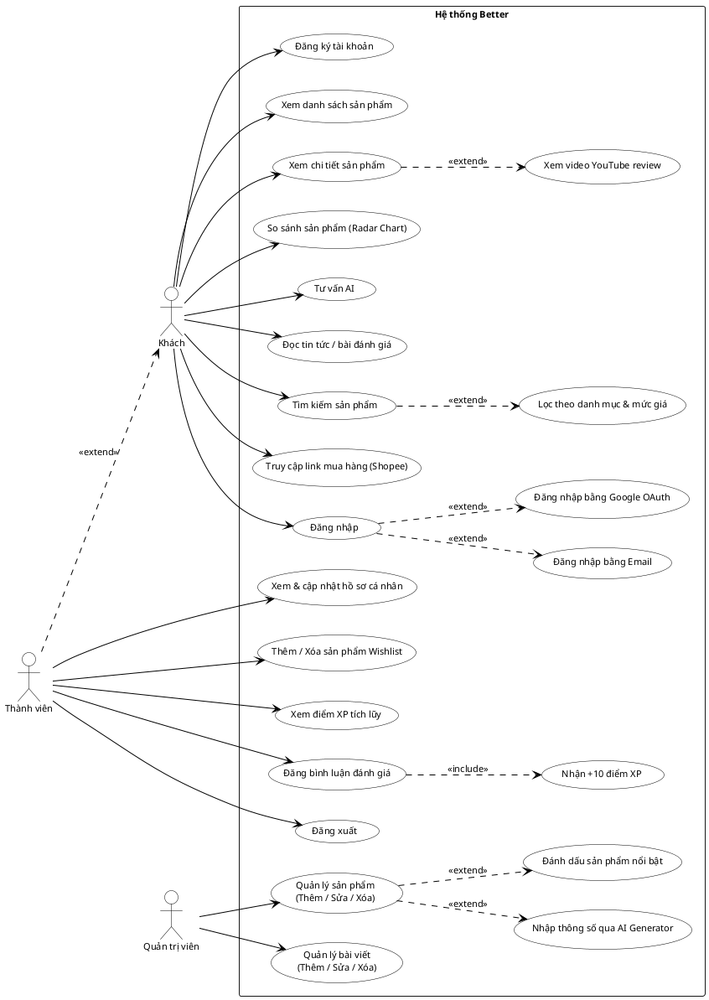


---


##### 3.2.1.2. Biểu Đồ Use Case Phân Rã

###### UC1 – Xem & So Sánh Sản Phẩm (Khách)

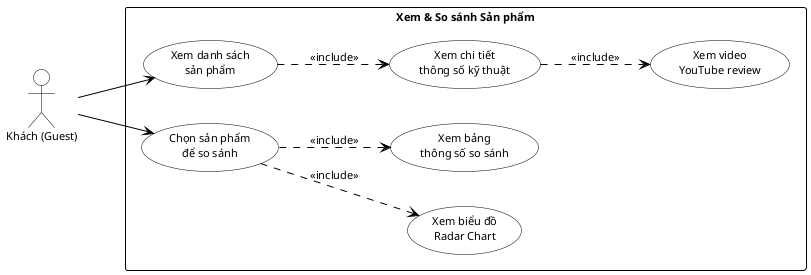

**Đặc tả Use Case UC1 – Xem & So Sánh Sản Phẩm**

| Thuộc tính | Nội dung |
|---|---|
| **Actor** | Khách vãng lai (Guest) |
| **Điều kiện tiên quyết** | Hệ thống đã kết nối MongoDB Atlas; danh sách sản phẩm tồn tại trong CSDL |
| **Hậu điều kiện** | Người dùng đã xem được thông số sản phẩm hoặc biểu đồ so sánh |

**Luồng sự kiện chính – Xem chi tiết sản phẩm:**
1. Người dùng truy cập trang chủ, hệ thống gọi `GET /api/products` và hiển thị danh sách dạng card.
2. Người dùng chọn tab **Điện thoại** hoặc **Laptop** để lọc theo danh mục.
3. Người dùng nhấn vào một card sản phẩm; hệ thống mở modal `ProductDetailsModal` với đầy đủ thông số kỹ thuật (CPU, RAM, màn hình, pin, camera...).
4. Bên trong modal, hệ thống nhúng trình phát YouTube (`youtubeUrl`) để người dùng xem video review trực tiếp.

**Luồng sự kiện chính – So sánh đa chiều:**
1. Người dùng nhấn nút **"So sánh"** trên card sản phẩm; thiết bị được thêm vào danh sách so sánh (tối đa 4 thiết bị).
2. Hệ thống hiển thị thanh nổi (floating bar) liệt kê các thiết bị đang chọn.
3. Người dùng nhấn **"Xem so sánh"**; hệ thống chuyển đến `CompareSection`.
4. `CompareSection` render biểu đồ **Radar Chart** (Recharts) với 5 trục: Hiệu năng – Màn hình – Camera – Pin & Sạc – Thiết kế, mỗi thiết bị một màu riêng.
5. Bên dưới biểu đồ, hệ thống hiển thị bảng song song các chỉ số kỹ thuật chi tiết.

**Luồng thay thế:**
- *Không có sản phẩm nào:* Hệ thống hiển thị thông báo "Không tìm thấy sản phẩm" thay vì danh sách trống.
- *Chọn quá 4 thiết bị:* Nút "So sánh" bị vô hiệu hóa; hệ thống hiển thị cảnh báo "Tối đa 4 sản phẩm".

---

###### UC2 – Tư Vấn AI (Khách)

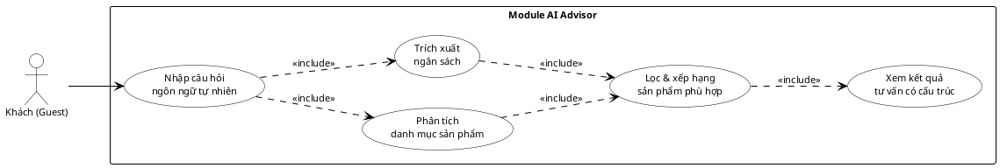

**Đặc tả Use Case UC2 – Tư Vấn AI**

| Thuộc tính | Nội dung |
|---|---|
| **Actor** | Khách vãng lai (Guest) |
| **Điều kiện tiên quyết** | CSDL sản phẩm có ít nhất một sản phẩm; module `AIAnalyzer` được tải |
| **Hậu điều kiện** | Người dùng nhận được danh sách gợi ý sản phẩm phù hợp nhu cầu |

**Luồng sự kiện chính:**
1. Người dùng nhập câu hỏi tự do vào ô nhập liệu, ví dụ: *"Điện thoại chụp ảnh đẹp, pin trâu, dưới 12 triệu"*.
2. Người dùng nhấn nút **"Tư vấn ngay"**; hệ thống nhận chuỗi văn bản đầu vào.
3. Module AI phân tích từ khóa danh mục: nếu chuỗi chứa "điện thoại" → lọc category `phone`; nếu chứa "laptop" → lọc category `laptop`.
4. Biểu thức chính quy trích xuất con số ngân sách (ví dụ: "12 triệu" → `12000000`).
5. Hệ thống lọc danh sách sản phẩm từ CSDL theo danh mục và khoảng giá `priceValue ≤ ngân_sách`.
6. Kết quả được xếp hạng theo `priceValue` giảm dần; sản phẩm đầu tiên là **"Phương án ưu tiên"**, sản phẩm thứ hai là **"Phương án dự phòng"**.
7. Hệ thống trả về card kết quả kèm lý do gợi ý (tên, giá, điểm nổi bật).

**Luồng thay thế:**
- *Không xác định được danh mục:* Hệ thống tìm kiếm trên toàn bộ sản phẩm không phân biệt category.
- *Không tìm thấy sản phẩm phù hợp ngân sách:* Hệ thống hiển thị thông báo "Không tìm thấy sản phẩm trong tầm giá" và gợi ý nâng ngân sách.

---

###### UC3 – Đọc Tin Tức (Khách)

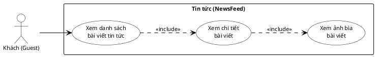

**Đặc tả Use Case UC3 – Đọc Tin Tức**

| Thuộc tính | Nội dung |
|---|---|
| **Actor** | Khách vãng lai (Guest) |
| **Điều kiện tiên quyết** | Hệ thống đã kết nối MongoDB Atlas; tồn tại ít nhất một bài viết trong collection `Posts` |
| **Hậu điều kiện** | Người dùng đã đọc được nội dung bài viết và xem ảnh bìa |

**Luồng sự kiện chính:**
1. Người dùng cuộn xuống phần **NewsFeed** trên trang chủ hoặc điều hướng đến mục Tin tức.
2. Hệ thống gọi `GET /api/posts` (sắp xếp theo `createdAt` giảm dần) và hiển thị danh sách bài viết dạng card, mỗi card gồm: ảnh bìa, tiêu đề, tóm tắt và ngày đăng.
3. Người dùng nhấn vào một card bài viết; hệ thống mở rộng hoặc điều hướng đến trang chi tiết bài viết.
4. Trang chi tiết hiển thị đầy đủ: ảnh bìa kích thước lớn, tiêu đề, ngày đăng và toàn bộ nội dung (`content`) của bài viết.
5. Người dùng đọc nội dung; có thể cuộn trở lại danh sách bằng nút **"Quay lại"** hoặc thanh điều hướng.

**Luồng thay thế:**
- *Chưa có bài viết nào:* Hệ thống hiển thị thông báo "Chưa có bài viết nào" thay vì danh sách trống.
- *Lỗi kết nối API:* Hệ thống hiển thị thông báo lỗi và nút thử lại; không crash trang.

---

###### UC4 – Tìm Kiếm & Lọc Sản Phẩm (Khách)

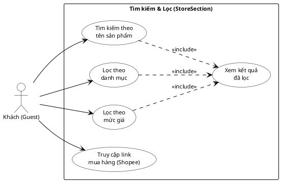

**Đặc tả Use Case UC4 – Tìm Kiếm & Lọc Sản Phẩm**

| Thuộc tính | Nội dung |
|---|---|
| **Actor** | Khách vãng lai (Guest) |
| **Điều kiện tiên quyết** | Hệ thống đã tải danh sách sản phẩm từ `GET /api/products` vào bộ nhớ client |
| **Hậu điều kiện** | Người dùng xem được danh sách sản phẩm phù hợp tiêu chí, hoặc được điều hướng đến trang mua hàng bên ngoài |

**Luồng sự kiện chính – Tìm kiếm theo tên:**
1. Người dùng điều hướng đến phần **StoreSection** (Cửa hàng).
2. Hệ thống hiển thị ô nhập tìm kiếm và toàn bộ danh sách sản phẩm.
3. Người dùng gõ từ khóa (ví dụ: "iPhone 16") vào ô tìm kiếm.
4. Frontend lọc phía client (`filter`) theo trường `name` chứa từ khóa (không phân biệt hoa thường).
5. Danh sách sản phẩm cập nhật theo thời gian thực mà không cần reload trang.

**Luồng sự kiện chính – Lọc theo danh mục & mức giá:**
1. Người dùng chọn danh mục từ `FilterSidebar` (Điện thoại / Laptop / Tất cả).
2. Người dùng kéo thanh trượt hoặc chọn khoảng giá (ví dụ: 5–15 triệu).
3. Frontend áp dụng đồng thời cả hai bộ lọc: `category === chọn` và `priceValue >= min && priceValue <= max`.
4. Danh sách sản phẩm thu hẹp theo điều kiện lọc; hiển thị số lượng kết quả tìm được.
5. Người dùng nhấn vào sản phẩm để xem chi tiết hoặc chọn để so sánh.

**Luồng sự kiện chính – Truy cập link mua hàng:**
1. Người dùng nhấn nút **"Mua ngay"** trên card sản phẩm trong StoreSection.
2. Hệ thống mở tab mới dẫn đến trang sản phẩm trên **Shopee** hoặc **TikTok Shop** (link được lưu sẵn trong dữ liệu sản phẩm).
3. Trang Better không tải lại; người dùng có thể tiếp tục duyệt sản phẩm.

**Luồng thay thế:**
- *Không tìm thấy sản phẩm nào:* Hệ thống hiển thị thông báo "Không có sản phẩm phù hợp" và gợi ý xóa bộ lọc.
- *Từ khóa quá ngắn (< 2 ký tự):* Hệ thống hiển thị toàn bộ danh sách thay vì lọc.

---

###### UC5 – Đăng Ký / Đăng Nhập (Khách)

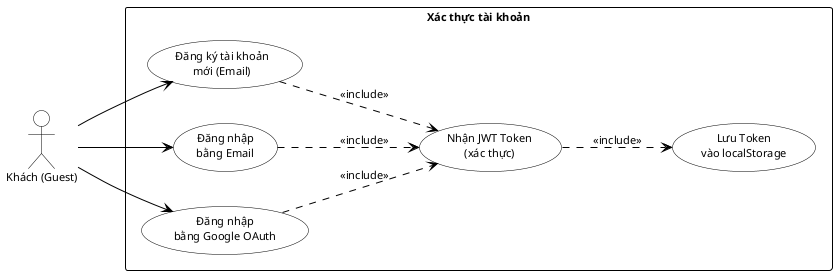

**Đặc tả Use Case UC5 – Đăng Ký / Đăng Nhập**

| Thuộc tính | Nội dung |
|---|---|
| **Actor** | Khách vãng lai (Guest) |
| **Điều kiện tiên quyết** | Người dùng chưa đăng nhập; backend đang hoạt động |
| **Hậu điều kiện** | Người dùng được xác thực, JWT Token lưu vào localStorage, giao diện chuyển sang trạng thái đã đăng nhập |

**Luồng sự kiện chính – Đăng ký:**
1. Người dùng nhấn **"Đăng ký"** trên Header, hệ thống mở modal `AuthModal`.
2. Người dùng nhập Email, Họ tên và Mật khẩu (tối thiểu 6 ký tự).
3. Frontend gửi `POST /api/auth/register` với payload `{ email, password, displayName }`.
4. Backend kiểm tra email trùng; nếu chưa tồn tại, tạo salt và hash mật khẩu bằng `bcrypt.hash(password, 10)`.
5. Tài khoản mới được lưu vào collection `Users` với `role: 'User'` và `points: 0`.
6. Backend phản hồi `{ message: "Thành công" }`; frontend tự động chuyển sang bước đăng nhập.

**Luồng sự kiện chính – Đăng nhập Email:**
1. Người dùng nhập Email và Mật khẩu, nhấn **"Đăng nhập"**.
2. Frontend gửi `POST /api/auth/login`; backend tìm user theo email.
3. Backend gọi `bcrypt.compare(password, user.password)` để xác thực.
4. Nếu khớp, backend ký JWT: `jwt.sign({ _id, role }, JWT_SECRET)` và trả về `{ token, user }`.
5. Frontend lưu token vào `localStorage` và cập nhật Context toàn ứng dụng.

**Luồng sự kiện chính – Đăng nhập Google OAuth:**
1. Người dùng nhấn **"Đăng nhập bằng Google"**; Firebase SDK mở popup xác thực Google.
2. Google trả về thông tin hồ sơ (email, displayName, photoURL).
3. Frontend gửi thông tin lên backend để đồng bộ hoặc tạo mới tài khoản.
4. Backend trả về JWT Token; quá trình tiếp theo giống đăng nhập Email.

**Luồng thay thế:**
- *Email đã tồn tại (đăng ký):* Backend trả về lỗi 400 "Email đã tồn tại"; frontend hiển thị thông báo đỏ.
- *Sai mật khẩu (đăng nhập):* Backend trả về lỗi 400 "Mật khẩu sai"; người dùng được thử lại.

---

###### UC6 – Quản Lý Hồ Sơ & Wishlist (Thành viên)

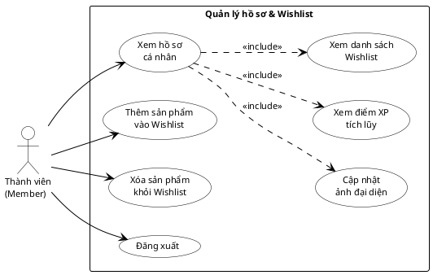

**Đặc tả Use Case UC6 – Quản Lý Hồ Sơ & Wishlist**

| Thuộc tính | Nội dung |
|---|---|
| **Actor** | Thành viên đã đăng nhập (Member) |
| **Điều kiện tiên quyết** | Thành viên đã xác thực thành công; JWT Token hợp lệ đang lưu trong localStorage |
| **Hậu điều kiện** | Thông tin hồ sơ hoặc danh sách Wishlist được cập nhật trong MongoDB |

**Luồng sự kiện chính – Xem hồ sơ cá nhân:**
1. Thành viên nhấn vào **ảnh đại diện** hoặc tên tài khoản trên Header; hệ thống mở modal `UserProfileModal`.
2. Hệ thống gọi `GET /api/users/me` với Header `Authorization: Bearer <token>`; backend trả về thông tin user (không bao gồm trường `password`).
3. Modal hiển thị: ảnh đại diện, tên hiển thị, email, **điểm XP tích lũy** và danh sách Wishlist hiện có.

**Luồng sự kiện chính – Quản lý Wishlist:**
1. Người dùng nhấn nút **♡ (Yêu thích)** trên card sản phẩm.
2. Nếu sản phẩm chưa có trong Wishlist: hệ thống thêm `productId` vào mảng `wishlist[]` của user và gọi `PUT /api/users/me` với `{ wishlist: [...wishlist, productId] }`.
3. Nếu sản phẩm đã có trong Wishlist: hệ thống xóa `productId` khỏi mảng và cập nhật lên server tương tự.
4. Backend cập nhật trường `wishlist` trong MongoDB; trả về user mới nhất.
5. Giao diện cập nhật trạng thái nút tim (đỏ = đã thêm / trắng = chưa thêm) ngay lập tức.

**Luồng sự kiện chính – Đăng xuất:**
1. Thành viên nhấn nút **"Đăng xuất"** trong modal hồ sơ hoặc menu dropdown.
2. Frontend xóa JWT Token khỏi `localStorage`: `localStorage.removeItem('token')`.
3. Context người dùng được reset về `null`; giao diện Header chuyển về trạng thái chưa đăng nhập.
4. Người dùng vẫn ở trang hiện tại nhưng các tính năng yêu cầu xác thực bị vô hiệu hóa.

**Luồng thay thế:**
- *Token hết hạn khi mở hồ sơ:* Backend trả về lỗi 401; frontend tự động đăng xuất và yêu cầu đăng nhập lại.
- *Cập nhật Wishlist thất bại (mất mạng):* Hệ thống rollback trạng thái nút tim về trạng thái trước đó và hiển thị thông báo lỗi.

---

###### UC7 – Bình Luận & Điểm XP (Thành viên)

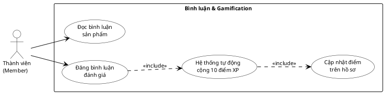

**Đặc tả Use Case UC7 – Bình Luận & Điểm XP (Gamification)**

| Thuộc tính | Nội dung |
|---|---|
| **Actor** | Thành viên đã đăng nhập (Member) |
| **Điều kiện tiên quyết** | Thành viên đã đăng nhập và có JWT Token hợp lệ trong localStorage |
| **Hậu điều kiện** | Bình luận được lưu vào CSDL; điểm XP của Thành viên tăng thêm 10 |

**Luồng sự kiện chính – Đăng bình luận:**
1. Thành viên mở trang chi tiết sản phẩm; hệ thống gọi `GET /api/reviews/:productId` và hiển thị danh sách bình luận hiện có.
2. Thành viên nhập nội dung đánh giá vào ô nhập liệu của `CommentSection`.
3. Thành viên nhấn **"Gửi bình luận"**; frontend gửi `POST /api/reviews` với Header `Authorization: Bearer <token>` và body `{ productId, text, userName, userPhoto, pointsToAdd: 10 }`.
4. Backend gọi `authMiddleware` xác thực JWT; nếu hợp lệ, tạo đối tượng `Review` mới và lưu vào MongoDB.
5. Ngay sau đó, backend thực thi `User.findByIdAndUpdate(userId, { $inc: { points: 10 } })` để cộng điểm XP.
6. Backend phản hồi `{ review }` thành công; frontend cập nhật danh sách bình luận mà không cần tải lại trang.

**Luồng thay thế:**
- *Token hết hạn hoặc không hợp lệ:* Backend trả về lỗi 401; frontend hiển thị thông báo "Vui lòng đăng nhập lại" và chuyển hướng về trang đăng nhập.
- *Nội dung bình luận rỗng:* Frontend kiểm tra và không cho gửi; hiển thị cảnh báo "Vui lòng nhập nội dung đánh giá".

---

###### UC8 – Quản Trị Sản Phẩm (Admin)

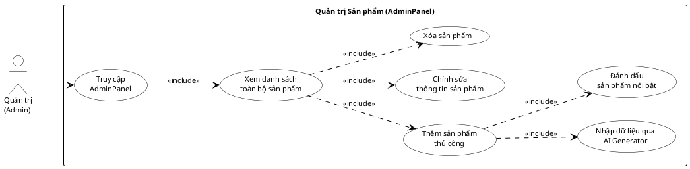

**Đặc tả Use Case UC8 – Quản Trị Sản Phẩm**

| Thuộc tính | Nội dung |
|---|---|
| **Actor** | Quản trị viên (Admin) |
| **Điều kiện tiên quyết** | Admin đã đăng nhập với `role: 'Admin'`; JWT Token hợp lệ |
| **Hậu điều kiện** | CSDL Products được cập nhật (thêm / sửa / xóa); danh sách sản phẩm trên giao diện phản ánh thay đổi |

**Luồng sự kiện chính – Thêm sản phẩm:**
1. Admin nhấn nút **"Quản trị"** trên Header (chỉ hiển thị khi `role === 'Admin'`); hệ thống mở `AdminPanel`.
2. Admin nhấn **"Thêm sản phẩm mới"**; hệ thống hiển thị form `ProductForm` trống.
3. Admin điền các trường: tên, thương hiệu, giá, danh mục, URL ảnh, URL YouTube, toàn bộ thông số kỹ thuật (`specs`).
4. *(Tùy chọn)* Admin nhấn **"Nhập từ AI"**, nhập tên sản phẩm; hệ thống gọi `GET /api/scrape?query=<tên>` → module `aiGenerator.js` gọi Pollinations AI API và tự động điền thông số vào form.
5. Admin nhấn **"Lưu"**; frontend gửi `POST /api/products` với toàn bộ dữ liệu form.
6. Backend thực hiện `findOneAndUpdate({ id }, data, { upsert: true })` – tạo mới nếu chưa tồn tại.
7. Backend phản hồi sản phẩm vừa lưu; `AdminPanel` cập nhật danh sách.

**Luồng sự kiện chính – Xóa sản phẩm:**
1. Admin nhấn nút **"Xóa"** bên cạnh sản phẩm trong danh sách; hệ thống hiển thị hộp thoại xác nhận.
2. Admin xác nhận; frontend gửi `DELETE /api/products/:id`.
3. Backend gọi `Product.findOneAndDelete({ id })` và phản hồi `{ message: 'Xoá thành công' }`.
4. Frontend xóa sản phẩm khỏi danh sách hiển thị mà không cần tải lại trang.

**Luồng thay thế:**
- *AI Generator không trả về dữ liệu:* Hệ thống hiển thị lỗi "Không tìm thấy dữ liệu"; Admin tự điền thủ công.
- *Admin không có quyền:* JWT Middleware trả về lỗi 401; giao diện không hiển thị `AdminPanel`.

---

###### UC9 – Quản Trị Bài Viết (Admin)

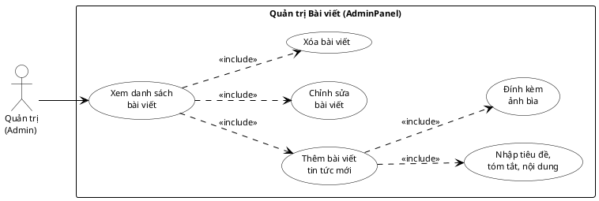

**Đặc tả Use Case UC9 – Quản Trị Bài Viết**

| Thuộc tính | Nội dung |
|---|---|
| **Actor** | Quản trị viên (Admin) |
| **Điều kiện tiên quyết** | Admin đã đăng nhập với `role: 'Admin'`; đang ở trong `AdminPanel` |
| **Hậu điều kiện** | CSDL Posts được cập nhật; danh sách tin tức trên `NewsFeed` phản ánh thay đổi |

**Luồng sự kiện chính – Thêm bài viết:**
1. Trong `AdminPanel`, Admin chuyển sang tab **"Quản lý Bài viết"**; hệ thống gọi `GET /api/posts` và hiển thị danh sách bài viết hiện có theo thứ tự mới nhất.
2. Admin nhấn **"Thêm bài viết mới"**; hệ thống hiển thị form `NewsForm`.
3. Admin điền các trường bắt buộc: **Tiêu đề** (`title`), **Tóm tắt** (`summary`), **Nội dung** (`content`), **URL ảnh bìa** (`image`), **Ngày đăng** (`date`).
4. Admin nhấn **"Lưu"**; frontend gửi `POST /api/posts` với toàn bộ dữ liệu form.
5. Backend thực hiện `Post.findOneAndUpdate({ id }, data, { upsert: true })` và lưu vào MongoDB.
6. Backend phản hồi bài viết vừa tạo; danh sách trong `AdminPanel` được làm mới.

**Luồng sự kiện chính – Chỉnh sửa bài viết:**
1. Admin nhấn nút **"Sửa"** bên cạnh bài viết; hệ thống load dữ liệu hiện có vào `NewsForm`.
2. Admin thay đổi nội dung cần cập nhật rồi nhấn **"Lưu"**.
3. Frontend gửi `POST /api/posts` với `id` trùng → backend thực hiện upsert, ghi đè dữ liệu cũ.

**Luồng sự kiện chính – Xóa bài viết:**
1. Admin nhấn nút **"Xóa"**; hệ thống yêu cầu xác nhận.
2. Admin xác nhận; frontend gửi `DELETE /api/posts/:id`.
3. Backend gọi `Post.findOneAndDelete({ id })` và phản hồi thành công; danh sách cập nhật ngay lập tức.

**Luồng thay thế:**
- *Thiếu trường bắt buộc:* Frontend kiểm tra và hiển thị cảnh báo; không gửi request lên server.
- *Bài viết không tồn tại khi xóa:* Backend trả về lỗi 404; frontend thông báo và làm mới danh sách.

---

#### 3.2.2. Biểu Đồ Trình Tự

Biểu đồ trình tự (Sequence Diagram) mô tả chi tiết thứ tự các thông điệp trao đổi giữa các thành phần hệ thống theo thời gian, thể hiện rõ cách các đối tượng tương tác với nhau để thực hiện một ca sử dụng cụ thể. Phần này trình bày **6 biểu đồ trình tự** tương ứng với các luồng nghiệp vụ quan trọng nhất của hệ thống Better.

---

##### SD1 – Đăng Ký & Đăng Nhập Tài Khoản

Biểu đồ mô tả luồng xác thực người dùng từ lúc nhập thông tin đến khi nhận được JWT Token và truy cập vào hệ thống.

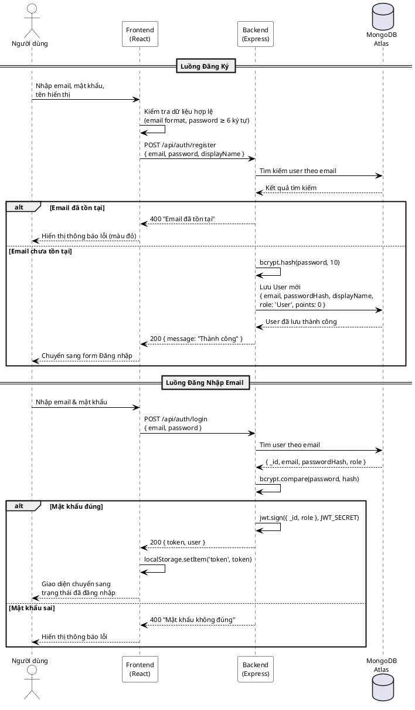

**Mô tả:** Khi đăng ký, backend sử dụng `bcrypt` để mã hóa mật khẩu trước khi lưu vào MongoDB. Khi đăng nhập thành công, backend ký và trả về JWT Token; frontend lưu token vào `localStorage` và cập nhật trạng thái Context toàn ứng dụng.

---

##### SD2 – Xem & So Sánh Sản Phẩm

Biểu đồ mô tả luồng tải danh sách sản phẩm, xem chi tiết và thực hiện so sánh đa chiều bằng Radar Chart.

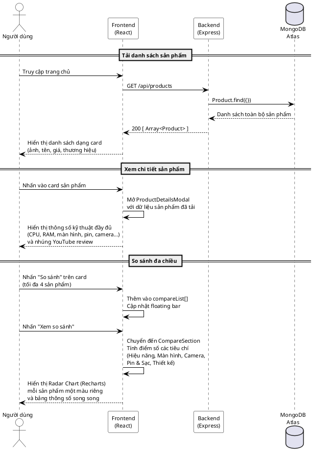

**Mô tả:** Dữ liệu sản phẩm được tải một lần từ API và lưu vào state của React. Toàn bộ logic lọc, tìm kiếm và so sánh được thực hiện phía client (client-side filtering), giúp giao diện phản hồi tức thì mà không cần thêm request tới server.

---

##### SD3 – Tư Vấn AI Advisor

Biểu đồ mô tả luồng xử lý khi người dùng đặt câu hỏi tư vấn bằng ngôn ngữ tự nhiên và hệ thống phân tích để trả về gợi ý sản phẩm.

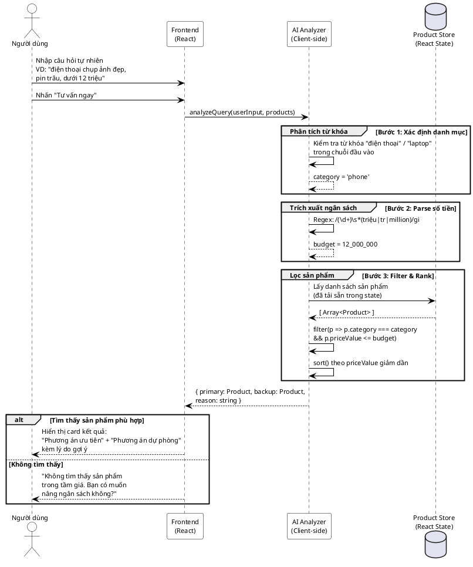

**Mô tả:** Module AI Advisor chạy hoàn toàn phía client, không cần gọi API bên ngoài. Hệ thống sử dụng biểu thức chính quy và so khớp từ khóa để phân tích câu hỏi, đảm bảo phản hồi tức thì và không phụ thuộc vào kết nối mạng sau khi dữ liệu đã được tải.

---

##### SD4 – Đăng Bình Luận & Tích Điểm XP

Biểu đồ mô tả luồng thành viên đăng bình luận đánh giá sản phẩm, bao gồm xác thực JWT và cơ chế cộng điểm Gamification.

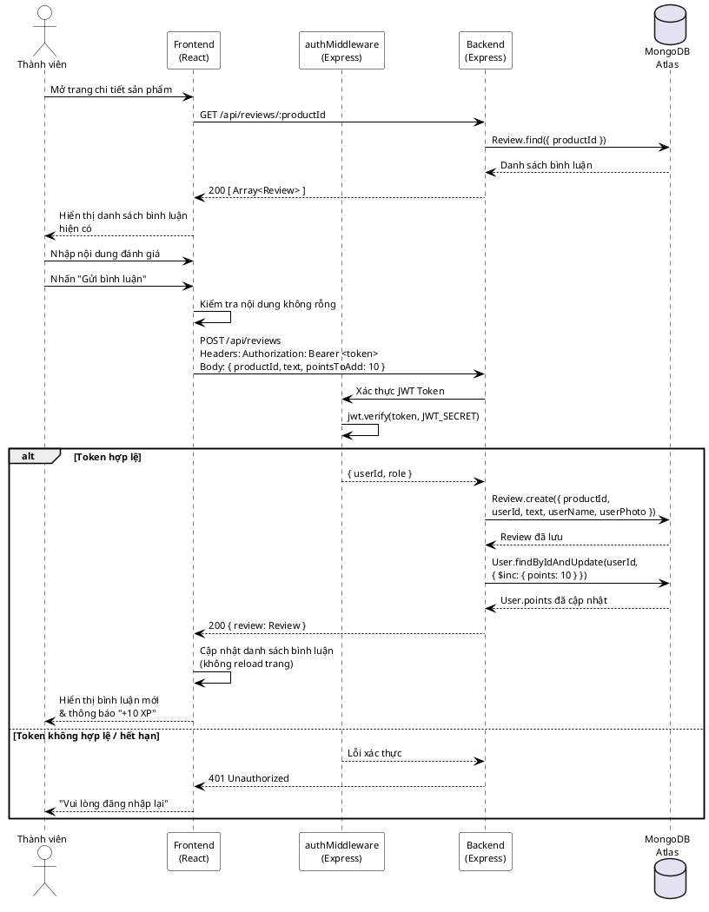

**Mô tả:** Mỗi lần đăng bình luận thành công, backend thực hiện hai thao tác ghi vào MongoDB trong cùng một request: tạo bản ghi `Review` mới và cập nhật trường `points` của `User` bằng toán tử `$inc`. Điều này đảm bảo tính nhất quán của dữ liệu Gamification.

---

##### SD5 – Quản Trị Sản Phẩm (Admin)

Biểu đồ mô tả luồng Admin thêm sản phẩm mới, bao gồm tính năng tự động sinh thông số kỹ thuật qua AI Generator.

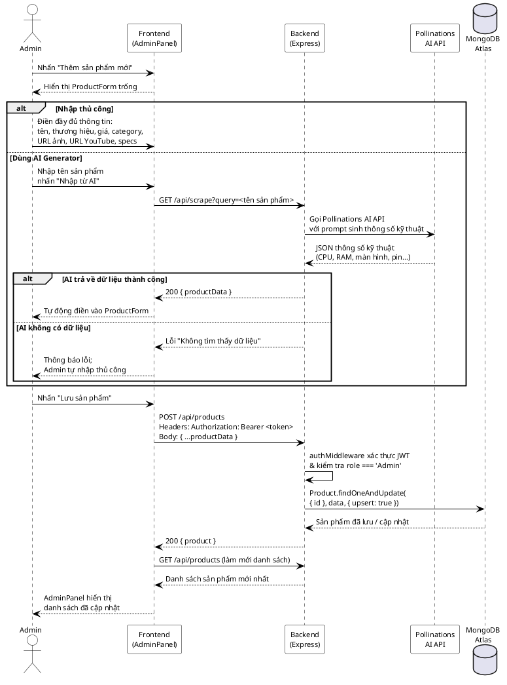

**Mô tả:** Tính năng AI Generator giúp Admin tiết kiệm thời gian nhập liệu bằng cách tự động truy vấn Pollinations AI API và điền sẵn thông số kỹ thuật vào form. Backend sử dụng `upsert: true` để đảm bảo thao tác thêm mới và cập nhật đều dùng chung một endpoint.

---

##### SD6 – Quản Lý Wishlist (Thành viên)

Biểu đồ mô tả luồng thành viên thêm hoặc xóa sản phẩm khỏi danh sách yêu thích cá nhân.

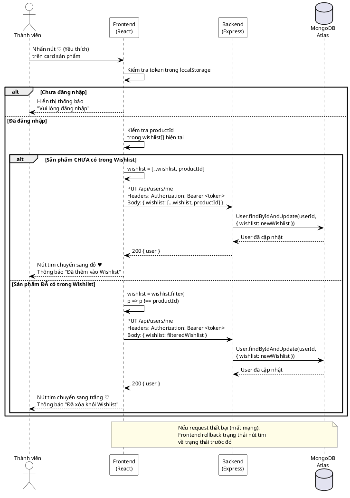

**Mô tả:** Wishlist được lưu trữ trong document `User` dưới dạng mảng `productId`. Mỗi lần toggle, frontend cập nhật optimistically (cập nhật UI trước) để tạo trải nghiệm tức thì, sau đó đồng bộ lên server. Nếu request thất bại, UI sẽ rollback về trạng thái trước đó.

---

### 3.3. Thiết Kế Cơ Sở Dữ Liệu

Hệ thống Better sử dụng **MongoDB Atlas** – cơ sở dữ liệu NoSQL dạng tài liệu (Document Database) được triển khai trên đám mây. Thay vì các bảng quan hệ cứng nhắc (RDBMS), MongoDB lưu trữ dữ liệu dưới dạng các document JSON linh hoạt, phù hợp với việc lưu thông số kỹ thuật sản phẩm có cấu trúc biến đổi theo từng loại thiết bị.

---

#### 3.3.1. Cơ Sở Dữ Liệu Tổng Quát

Hệ thống gồm **4 collection** chính, với các mối quan hệ tham chiếu (Reference) thay vì khóa ngoại (Foreign Key) trực tiếp:

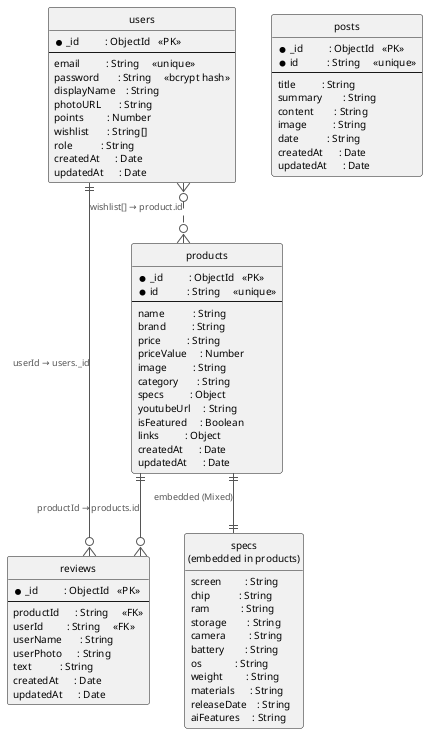

**Giải thích kiến trúc:**

| Mối quan hệ | Loại | Mô tả |
|---|---|---|
| `users` ↔ `reviews` | 1–N (Reference) | Một user có thể đăng nhiều review; `reviews.userId` lưu `users._id` dạng String |
| `products` ↔ `reviews` | 1–N (Reference) | Một sản phẩm có nhiều review; `reviews.productId` lưu `products.id` tùy chỉnh |
| `users` ↔ `products` (Wishlist) | N–M (Array Reference) | Mảng `users.wishlist[]` lưu danh sách `product.id` mà user yêu thích |
| `products` ↔ `specs` | 1–1 (Embedded) | Thông số kỹ thuật được nhúng trực tiếp vào document sản phẩm (không tách collection) |

---

#### 3.3.2. Chi Tiết Các Collection

##### Collection 1 – `users` (Người Dùng)

Lưu trữ toàn bộ thông tin tài khoản, điểm XP gamification và danh sách yêu thích của người dùng.

```plantuml
@startuml
skinparam backgroundColor #FFFFFF
skinparam defaultFontName Arial
skinparam defaultFontSize 10
skinparam shadowing false

hide circle
hide methods

skinparam entity {
  BackgroundColor #FFFFFF
  BorderColor #AAAAAA
  HeaderBackgroundColor #EEEEEE
  FontSize 10
  AttributeFontSize 10
}

entity "users" as users {
  * _id          : ObjectId   <<PK, auto>>
  --
  email          : String     <<required, unique>>
  password       : String     <<bcrypt, salt=10>>
  displayName    : String
  photoURL       : String
  points         : Number     <<default: 0>>
  wishlist       : String[]   <<product.id refs>>
  role           : String     <<"User" | "Admin">>
  createdAt      : Date       <<auto>>
  updatedAt      : Date       <<auto>>
}

note bottom of users
  email: unique index
  password: không trả về qua API (.select('-password'))
  points: +10 mỗi lần đăng bình luận
  wishlist: mảng product.id tùy chỉnh
end note

@enduml
```

| Trường | Kiểu dữ liệu | Ràng buộc | Mô tả |
|---|---|---|---|
| `_id` | ObjectId | PK, Auto | MongoDB tự sinh, định danh duy nhất |
| `email` | String | Required, Unique | Email đăng nhập; là khóa tra cứu chính |
| `password` | String | Required | Mật khẩu đã hash bằng `bcrypt` (salt = 10) |
| `displayName` | String | Optional | Tên hiển thị trên giao diện và bình luận |
| `photoURL` | String | Optional | URL ảnh đại diện (từ Google OAuth hoặc tự upload) |
| `points` | Number | Default: 0 | Điểm XP tích lũy; tăng +10 mỗi lần đăng bình luận |
| `wishlist` | [String] | Optional | Mảng các `product.id` mà user đã yêu thích |
| `role` | String | Default: "User" | Phân quyền: `"User"` hoặc `"Admin"` |
| `createdAt` | Date | Auto | Timestamp tạo tài khoản (mongoose `timestamps`) |
| `updatedAt` | Date | Auto | Timestamp cập nhật lần cuối |

---

##### Collection 2 – `products` (Sản Phẩm)

Lưu trữ toàn bộ thông tin sản phẩm công nghệ bao gồm thông số kỹ thuật dưới dạng JSON nhúng linh hoạt.

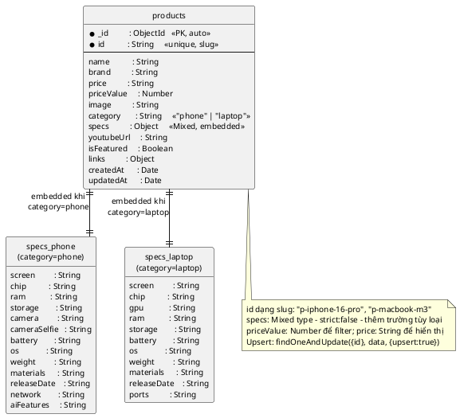

| Trường | Kiểu dữ liệu | Ràng buộc | Mô tả |
|---|---|---|---|
| `_id` | ObjectId | PK, Auto | MongoDB tự sinh |
| `id` | String | Required, Unique | Khóa tùy chỉnh dạng slug (VD: `"p-iphone-16-pro"`) |
| `name` | String | Required | Tên đầy đủ của sản phẩm |
| `brand` | String | Required | Thương hiệu (Apple, Samsung, Xiaomi...) |
| `price` | String | Optional | Giá hiển thị dạng văn bản (VD: `"32,990,000 đ"`) |
| `priceValue` | Number | Optional | Giá dạng số để lọc và sắp xếp |
| `image` | String | Optional | URL ảnh đại diện sản phẩm |
| `category` | String | Optional | Danh mục: `"phone"` hoặc `"laptop"` |
| `specs` | Mixed | Optional | Object JSON nhúng chứa toàn bộ thông số kỹ thuật |
| `youtubeUrl` | String | Optional | URL video review trên YouTube |
| `isFeatured` | Boolean | Default: false | Đánh dấu sản phẩm nổi bật trên trang chủ |
| `links` | Object | Optional | Chứa `{ shopee, tiktok }` – link mua hàng |
| `createdAt` | Date | Auto | Timestamps mongoose |
| `updatedAt` | Date | Auto | Timestamps mongoose |

---

##### Collection 3 – `reviews` (Bình Luận & Đánh Giá)

Lưu trữ các bình luận/đánh giá của người dùng cho từng sản phẩm, đồng thời là nguồn kích hoạt cộng điểm XP.

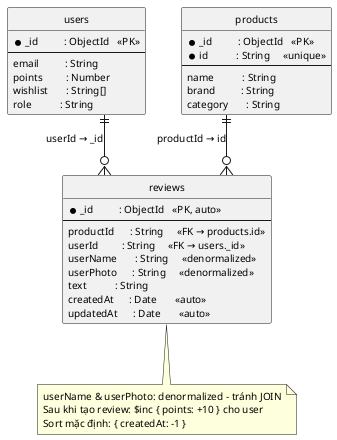

| Trường | Kiểu dữ liệu | Ràng buộc | Mô tả |
|---|---|---|---|
| `_id` | ObjectId | PK, Auto | MongoDB tự sinh |
| `productId` | String | Required | Tham chiếu đến `products.id` (custom key) |
| `userId` | String | Required | Tham chiếu đến `users._id` (ObjectId dạng String) |
| `userName` | String | Optional | Tên hiển thị user tại thời điểm đăng (denormalized) |
| `userPhoto` | String | Optional | URL ảnh đại diện user tại thời điểm đăng |
| `text` | String | Required | Nội dung bình luận/đánh giá |
| `createdAt` | Date | Auto | Timestamps – dùng để sort theo thứ tự mới nhất |
| `updatedAt` | Date | Auto | Timestamps mongoose |

---

##### Collection 4 – `posts` (Bài Viết Tin Tức)

Lưu trữ các bài viết tin tức công nghệ và bài đánh giá được Admin đăng tải lên NewsFeed.

```plantuml
@startuml
skinparam backgroundColor #FFFFFF
skinparam defaultFontName Arial
skinparam defaultFontSize 10
skinparam shadowing false

hide circle
hide methods

skinparam entity {
  BackgroundColor #FFFFFF
  BorderColor #AAAAAA
  HeaderBackgroundColor #EEEEEE
  FontSize 10
  AttributeFontSize 10
}

entity "posts" as posts {
  * _id          : ObjectId   <<PK, auto>>
  * id           : String     <<unique, slug>>
  --
  title          : String
  summary        : String
  content        : String     <<Markdown>>
  image          : String
  date           : String
  createdAt      : Date       <<auto, sort key>>
  updatedAt      : Date       <<auto>>
}

note bottom of posts
  id dạng slug: "news-101", "post-review-iphone16"
  Upsert: findOneAndUpdate({id}, data, {upsert:true})
  Sort: Post.find().sort({ createdAt: -1 })
  Chỉ Admin (role='Admin') mới có quyền CRUD
end note

@enduml
```

| Trường | Kiểu dữ liệu | Ràng buộc | Mô tả |
|---|---|---|---|
| `_id` | ObjectId | PK, Auto | MongoDB tự sinh |
| `id` | String | Required, Unique | Khóa tùy chỉnh (VD: `"news-101"`) |
| `title` | String | Required | Tiêu đề bài viết hiển thị trên card |
| `summary` | String | Optional | Tóm tắt ngắn (~2 dòng) hiển thị trên card |
| `content` | String | Optional | Nội dung đầy đủ (hỗ trợ Markdown) |
| `image` | String | Optional | URL ảnh bìa (Unsplash hoặc CDN) |
| `date` | String | Optional | Ngày đăng dạng văn bản để hiển thị |
| `createdAt` | Date | Auto | Timestamps – dùng để sort bài mới nhất lên đầu |
| `updatedAt` | Date | Auto | Timestamps mongoose |

#### 3.3.3. Chi Tiết Mối Quan Hệ Giữa Các Collection

Do MongoDB là cơ sở dữ liệu NoSQL không hỗ trợ JOIN bậc thấp như SQL, hệ thống Better sử dụng hai chiến lược tổ chức quan hệ: **Reference** (tham chiếu qua trường ID) và **Embedding** (nhúng trực tiếp). Phần này mô tả chi tiết từng mối quan hệ.

---

##### Quan hệ R1 – `users` → `reviews` (1 – Nhiều)

**Một người dùng có thể đăng nhiều bình luận, mỗi bình luận chỉ thuộc về một người dùng.**

```plantuml
@startuml
skinparam backgroundColor #FFFFFF
skinparam defaultFontName Arial
skinparam defaultFontSize 10
skinparam shadowing false
skinparam linetype ortho
hide circle
hide methods
skinparam entity {
  BackgroundColor #FFFFFF
  BorderColor #AAAAAA
  HeaderBackgroundColor #EEEEEE
  FontSize 10
  AttributeFontSize 10
}

entity "users" as U {
  * _id        : ObjectId  <<PK>>
  --
  email        : String
  displayName  : String
  points       : Number
  role         : String
}

entity "reviews" as R {
  * _id        : ObjectId  <<PK>>
  --
  userId       : String    <<FK → users._id>>
  productId    : String
  userName     : String    <<denormalized>>
  userPhoto    : String    <<denormalized>>
  text         : String
  createdAt    : Date
}

U ||--o{ R : "_id = userId"

note on link
  Khi user bị xóa:
  reviews của user vẫn tồn tại
  (MongoDB không có CASCADE DELETE)
end note

@enduml
```

| Thuộc tính | Chi tiết |
|---|---|
| **Loại quan hệ** | Một – Nhiều (1:N) bằng Reference |
| **Trường liên kết** | `reviews.userId` → `users._id` (String) |
| **Hướng tham chiếu** | `reviews` tham chiếu tới `users` (con → cha) |
| **Denormalization** | `userName`, `userPhoto` sao chép vào `reviews` để tránh lookup ngược |
| **Thao tác tạo** | `POST /api/reviews` → lấy `userId` từ JWT Token đã xác thực |
| **Thao tác liên quan** | Sau khi tạo review: `User.findByIdAndUpdate(userId, { $inc: { points: 10 } })` |
| **Truy vấn điển hình** | `Review.find({ productId }).sort({ createdAt: -1 })` – lấy tất cả review theo sản phẩm |
| **Lưu ý** | MongoDB không tự CASCADE DELETE → nếu xóa user, review vẫn còn; phải xử lý thủ công nếu cần |

---

##### Quan hệ R2 – `products` → `reviews` (1 – Nhiều)

**Một sản phẩm có thể có nhiều bình luận đánh giá, mỗi bình luận chỉ gắn với một sản phẩm.**

```plantuml
@startuml
skinparam backgroundColor #FFFFFF
skinparam defaultFontName Arial
skinparam defaultFontSize 10
skinparam shadowing false
skinparam linetype ortho
hide circle
hide methods
skinparam entity {
  BackgroundColor #FFFFFF
  BorderColor #AAAAAA
  HeaderBackgroundColor #EEEEEE
  FontSize 10
  AttributeFontSize 10
}

entity "products" as P {
  * _id        : ObjectId  <<PK>>
  * id         : String    <<unique, slug>>
  --
  name         : String
  brand        : String
  category     : String
  priceValue   : Number
}

entity "reviews" as R {
  * _id        : ObjectId  <<PK>>
  --
  productId    : String    <<FK → products.id>>
  userId       : String
  text         : String
  createdAt    : Date
}

P ||--o{ R : "id = productId"

note on link
  Dùng products.id (slug)
  không dùng products._id
  để URL thân thiện hơn
end note

@enduml
```

| Thuộc tính | Chi tiết |
|---|---|
| **Loại quan hệ** | Một – Nhiều (1:N) bằng Reference |
| **Trường liên kết** | `reviews.productId` → `products.id` (custom slug, không phải `_id`) |
| **Lý do dùng slug** | `products.id` dạng `"p-iphone-16-pro"` dễ đọc và dùng được trong URL API |
| **Truy vấn tạo** | `Review.create({ productId: req.body.productId, ... })` |
| **Truy vấn đọc** | `GET /api/reviews/:productId` → `Review.find({ productId }).sort({ createdAt: -1 })` |
| **Tính nhất quán** | Nếu xóa sản phẩm (`DELETE /api/products/:id`), review liên quan không tự xóa |

---

##### Quan hệ R3 – `users` ↔ `products` qua Wishlist (Nhiều – Nhiều)

**Một người dùng có thể yêu thích nhiều sản phẩm; một sản phẩm có thể được nhiều người yêu thích.**

```plantuml
@startuml
skinparam backgroundColor #FFFFFF
skinparam defaultFontName Arial
skinparam defaultFontSize 10
skinparam shadowing false
skinparam linetype ortho
hide circle
hide methods
skinparam entity {
  BackgroundColor #FFFFFF
  BorderColor #AAAAAA
  HeaderBackgroundColor #EEEEEE
  FontSize 10
  AttributeFontSize 10
}

entity "users" as U {
  * _id        : ObjectId  <<PK>>
  --
  email        : String
  displayName  : String
  wishlist     : String[]  <<mảng product.id>>
  points       : Number
}

entity "products" as P {
  * _id        : ObjectId  <<PK>>
  * id         : String    <<unique, slug>>
  --
  name         : String
  brand        : String
  priceValue   : Number
  isFeatured   : Boolean
}

U }o..o{ P : "wishlist[] ∋ product.id"

note bottom of U
  wishlist = ["p-iphone-16", "p-macbook-m3"]
  Không tách collection riêng;
  lưu trực tiếp trong document user
end note

@enduml
```

| Thuộc tính | Chi tiết |
|---|---|
| **Loại quan hệ** | Nhiều – Nhiều (N:M) bằng Array Reference |
| **Cách lưu trữ** | Mảng `users.wishlist[]` chứa danh sách `product.id` (String slug) |
| **Không có bảng trung gian** | Khác SQL, MongoDB không cần bảng `user_product_wishlist`; lưu thẳng trong `users` |
| **Thêm vào Wishlist** | `PUT /api/users/me` với `{ wishlist: [...current, newProductId] }` |
| **Xóa khỏi Wishlist** | `PUT /api/users/me` với `{ wishlist: wishlist.filter(id => id !== productId) }` |
| **Optimistic Update** | Frontend cập nhật UI ngay lập tức, đồng bộ server sau; rollback nếu request thất bại |
| **Giới hạn** | Phù hợp khi wishlist nhỏ (< vài trăm items); nếu wishlist lớn cần tách collection riêng |

---

##### Quan hệ R4 – `products` ↔ `specs` (Nhúng – Embedded 1:1)

**Thông số kỹ thuật được nhúng trực tiếp vào document sản phẩm thay vì tách collection riêng.**

```plantuml
@startuml
skinparam backgroundColor #FFFFFF
skinparam defaultFontName Arial
skinparam defaultFontSize 10
skinparam shadowing false
skinparam linetype ortho
hide circle
hide methods
skinparam entity {
  BackgroundColor #FFFFFF
  BorderColor #AAAAAA
  HeaderBackgroundColor #EEEEEE
  FontSize 10
  AttributeFontSize 10
}

entity "products" as P {
  * _id          : ObjectId  <<PK>>
  * id           : String
  --
  name           : String
  brand          : String
  category       : String
  priceValue     : Number
  isFeatured     : Boolean
  specs          : Object    <<EMBEDDED>>
  createdAt      : Date
}

entity "specs\n(phone)" as SP {
  screen         : String
  chip           : String
  ram            : String
  storage        : String
  camera         : String
  cameraSelfie   : String
  battery        : String
  os             : String
  weight         : String
  materials      : String
  releaseDate    : String
  network        : String
  aiFeatures     : String
}

entity "specs\n(laptop)" as SL {
  screen         : String
  chip           : String
  gpu            : String
  ram            : String
  storage        : String
  battery        : String
  os             : String
  weight         : String
  materials      : String
  releaseDate    : String
  ports          : String
}

P ||--|| SP : "category=\"phone\""
P ||--|| SL : "category=\"laptop\""

note bottom of P
  specs là trường Mixed (strict: false)
  Không validate schema cứng
  → thêm trường mới không cần migration
end note

@enduml
```

| Thuộc tính | Chi tiết |
|---|---|
| **Loại quan hệ** | Một – Một (1:1) bằng Embedding |
| **Cách lưu trữ** | Trường `specs` kiểu `mongoose.Schema.Types.Mixed` nằm trong document `products` |
| **Lý do Embed (không tách collection)** | Specs luôn được đọc cùng với sản phẩm → nhúng giúp tránh JOIN; giảm số round-trip database |
| **Linh hoạt theo loại** | `phone` có thêm `cameraSelfie`, `network`; `laptop` có thêm `gpu`, `ports` – Mixed type cho phép điều này |
| **Cập nhật** | Cập nhật toàn bộ document qua `POST /api/products` (upsert) hoặc chỉnh sửa trực tiếp qua AdminPanel |
| **AI Generator** | Module `aiGenerator.js` tự động điền toàn bộ `specs` từ Pollinations AI khi Admin nhập tên sản phẩm |
| **Nhược điểm** | Nếu cần query theo trường trong `specs` (VD: tìm tất cả phone có RAM ≥ 12GB) thì phải dùng dot notation: `{ "specs.ram": { $gte: "12GB" } }` |

---

##### Tổng Hợp Quan Hệ

```plantuml
@startuml
skinparam backgroundColor #FFFFFF
skinparam defaultFontName Arial
skinparam defaultFontSize 10
skinparam shadowing false
skinparam linetype ortho
hide circle
hide methods
skinparam entity {
  BackgroundColor #FFFFFF
  BorderColor #AAAAAA
  HeaderBackgroundColor #EEEEEE
  FontSize 10
  AttributeFontSize 10
}

entity "users" as U {
  * _id       : ObjectId <<PK>>
  --
  email       : String
  points      : Number
  wishlist    : String[]
  role        : String
}

entity "products" as P {
  * _id       : ObjectId <<PK>>
  * id        : String   <<slug>>
  --
  name        : String
  category    : String
  specs       : Object   <<embedded>>
  priceValue  : Number
  isFeatured  : Boolean
}

entity "reviews" as R {
  * _id       : ObjectId <<PK>>
  --
  userId      : String   <<FK>>
  productId   : String   <<FK>>
  userName    : String
  text        : String
  createdAt   : Date
}

entity "posts" as N {
  * _id       : ObjectId <<PK>>
  * id        : String   <<slug>>
  --
  title       : String
  content     : String
  createdAt   : Date
}

U ||--o{ R  : "R1: 1→N\nuserId = _id"
P ||--o{ R  : "R2: 1→N\nproductId = id"
U }o..o{ P  : "R3: N↔M\nwishlist[]"

note top of N
  posts không có quan hệ
  trực tiếp với collection khác.
  Độc lập – chỉ Admin CRUD.
end note

@enduml
```

| # | Quan hệ | Loại | Kỹ thuật | Trường liên kết |
|---|---|---|---|---|
| R1 | `users` → `reviews` | 1:N | Reference | `reviews.userId` → `users._id` |
| R2 | `products` → `reviews` | 1:N | Reference | `reviews.productId` → `products.id` |
| R3 | `users` ↔ `products` | N:M | Array trong `users` | `users.wishlist[]` ∋ `products.id` |
| R4 | `products` ↔ `specs` | 1:1 | Embedding | `products.specs` (Mixed Object) |
| – | `posts` | Độc lập | – | Không liên kết với collection khác |

---

#### 3.3.4. Sơ Đồ Quan Hệ Tổng Thể & Luồng Dữ Liệu

Biểu đồ dưới đây thể hiện toàn bộ mối quan hệ giữa các collection và luồng dữ liệu trong các nghiệp vụ chính:

```plantuml
@startuml
skinparam backgroundColor #FFFFFF
skinparam defaultFontName Arial
skinparam defaultFontSize 11
skinparam shadowing false
skinparam sequenceArrowColor #000000
skinparam sequenceLifeLineBorderColor #000000
skinparam sequenceLifeLineBackgroundColor #FFFFFF
skinparam sequenceParticipantBorderColor #000000
skinparam sequenceParticipantBackgroundColor #FFFFFF
skinparam sequenceActorBorderColor #000000
skinparam sequenceActorBackgroundColor #FFFFFF
skinparam sequenceBoxBorderColor #888888
skinparam sequenceBoxBackgroundColor #F5F5F5
skinparam noteBackgroundColor #FFFDE7
skinparam noteBorderColor #888888

actor "Client\n(React)" as Client
participant "Express\nServer" as Server
database "users" as UCol
database "products" as PCol
database "reviews" as RCol
database "posts" as NCol

== Nghiệp vụ: Đăng nhập & Tải dữ liệu cá nhân ==

Client -> Server : POST /api/auth/login\n{ email, password }
Server -> UCol : findOne({ email })
UCol --> Server : { _id, email, passwordHash,\nrole, points, wishlist[] }
Server --> Client : JWT Token + user object\n(không bao gồm password)

Client -> Server : GET /api/users/me\n[Bearer Token]
Server -> UCol : findById(_id).select('-password')
UCol --> Server : { email, displayName,\npoints, wishlist[], role }
Server --> Client : User profile

== Nghiệp vụ: Tải & Lọc sản phẩm ==

Client -> Server : GET /api/products
Server -> PCol : find({})
PCol --> Server : [ { id, name, brand, price,\npriceValue, specs{...}, isFeatured, ... } ]
Server --> Client : Array<Product>
note over Client : Client lọc theo category,\nkhoảng giá, từ khóa\n(client-side filtering)

== Nghiệp vụ: Đăng bình luận → Cộng XP ==

Client -> Server : POST /api/reviews\n[Bearer Token]\n{ productId, text, pointsToAdd: 10 }
Server -> RCol : create({ productId, userId,\nuserName, userPhoto, text })
RCol --> Server : Review document mới
Server -> UCol : findByIdAndUpdate(userId,\n{ $inc: { points: 10 } })
UCol --> Server : User với points đã tăng
Server --> Client : { review }

== Nghiệp vụ: Admin quản lý sản phẩm ==

Client -> Server : POST /api/products\n[Bearer Token]\n{ id, name, specs{...}, ... }
Server -> PCol : findOneAndUpdate({ id }, data,\n{ upsert: true, new: true })
PCol --> Server : Product đã lưu / cập nhật
Server --> Client : Product object

Client -> Server : DELETE /api/products/:id\n[Bearer Token]
Server -> PCol : findOneAndDelete({ id })
PCol --> Server : Deleted document
Server --> Client : { message: 'Xoá thành công' }

== Nghiệp vụ: Quản lý Wishlist ==

Client -> Server : PUT /api/users/me\n[Bearer Token]\n{ wishlist: ["p-id-1", "p-id-2"] }
Server -> UCol : findByIdAndUpdate(userId,\n{ wishlist: newArray },\n{ new: true })
UCol --> Server : User với wishlist mới
Server --> Client : Updated user object

@enduml
```

**Tổng kết thiết kế CSDL:**

| Tiêu chí | Quyết định thiết kế | Lý do |
|---|---|---|
| **Loại CSDL** | MongoDB (NoSQL Document) | Specs sản phẩm có cấu trúc biến đổi theo loại (phone vs laptop) |
| **Embedded vs Reference** | `specs` embedded trong `products`; `reviews` tham chiếu rời | Specs luôn được đọc cùng sản phẩm → embed; reviews cần query độc lập → ref |
| **Custom ID** | `products.id` và `posts.id` dùng slug tùy chỉnh | Dễ đọc, dễ debug; tránh dùng ObjectId trong URL |
| **Denormalization** | `reviews` lưu dư `userName`, `userPhoto` | Tránh JOIN nhiều lần khi render danh sách bình luận |
| **Wishlist** | Mảng `product.id` trong `users` | Wishlist cá nhân ít phần tử, không cần collection riêng |
| **Timestamps** | Dùng `timestamps: true` của Mongoose | Tự động quản lý `createdAt`/`updatedAt` cho tất cả collection |

---

### Kết Chương 3

Chương 3 đã trình bày đầy đủ kết quả phân tích và thiết kế hệ thống Better theo ba tầng: **đặc tả yêu cầu**, **mô hình hoá chức năng & hành vi**, và **thiết kế cơ sở dữ liệu**.

Về mặt đặc tả yêu cầu, hệ thống được xác định rõ với **3 nhóm người dùng** (Khách – Thành viên – Admin) và **9 nhóm chức năng** chính, mỗi nhóm có phạm vi truy cập được kiểm soát chặt chẽ bởi JWT Middleware. Về mặt mô hình hóa chức năng, **9 biểu đồ Use Case** (1 tổng quát và 8 phân rã) đã thể hiện đầy đủ hành vi tương tác của từng actor với từng chức năng cụ thể của hệ thống.

Về mặt mô hình hóa hành vi động, **6 biểu đồ trình tự** (SD1–SD6) đã làm rõ thứ tự trao đổi thông điệp giữa các thành phần Người dùng – Frontend – Backend – MongoDB cho các luồng nghiệp vụ cốt lõi, bao gồm: xác thực JWT, xem & so sánh sản phẩm, tư vấn AI phía client, gamification điểm XP, quản trị với AI Generator, và đồng bộ Wishlist theo mô hình optimistic update.

Về mặt thiết kế cơ sở dữ liệu, hệ thống sử dụng MongoDB Atlas với **4 collection** (`users`, `products`, `reviews`, `posts`), trong đó thông số kỹ thuật sản phẩm được lưu dạng JSON nhúng linh hoạt (Mixed type), Wishlist được lưu trực tiếp trong document user, và chiến lược upsert cho phép thêm mới & cập nhật qua cùng một endpoint.

Những kết quả thiết kế này là nền tảng trực tiếp để triển khai các API Endpoint, cấu trúc Component React, và cơ sở dữ liệu MongoDB trong quá trình cài đặt và xây dựng hệ thống.

---
